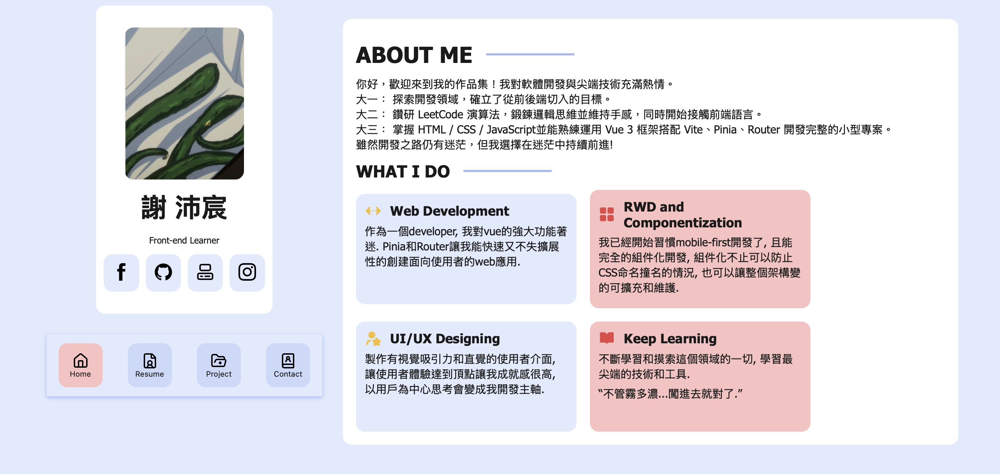
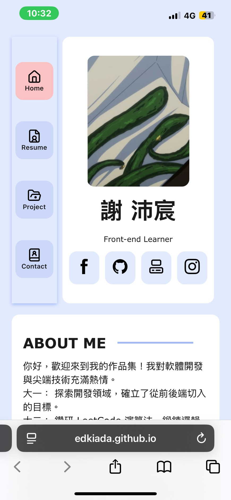

# Portfolios

This is a solution to the [Portfolios].

## Table of contents

- [Overview](#overview)
  - [The challenge](#the-challenge)
  - [Screenshot](#screenshot)
  - [Links](#links)
- [My process](#my-process)
  - [Built with](#built-with)
- [Author](#author)

## Overview

### The challenge

建立一個具備現代感、流暢動畫與高度響應式的個人作品集網站。

### Screenshot

#### Desktop Version

#### Mobile Version

### Links

- Solution URL: [GitHub](https://github.com/edkiada/portfolios)
- Live Site URL: [Countries App](https://edkiada.github.io/portfolios/)

## My process

### Built with

- Semantic HTML5 markup
- CSS custom properties
- Flexbox
- Mobile-first workflow
- Responsive design
- Router
- [vue 3](https://vuejs.org/) - Reactive components via Composition API.
- [Vite](https://nextjs.org/) - Fast frontend build tool.

## Author

- GitHub - [@edkiada](https://github.com/edkiada)
- Email - [yyh901277111@gmail.com](mailto:yyh901277111@gmail.com)
